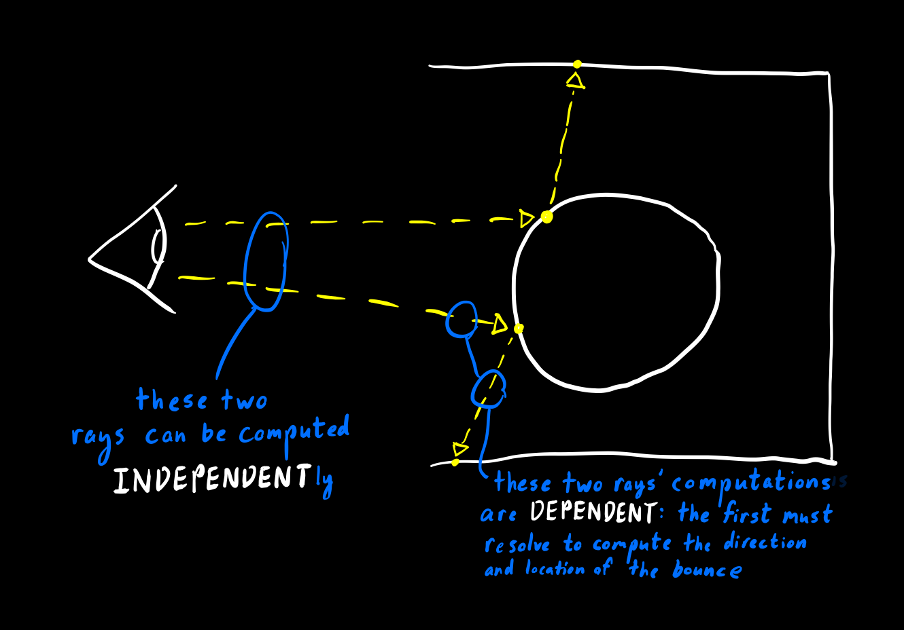
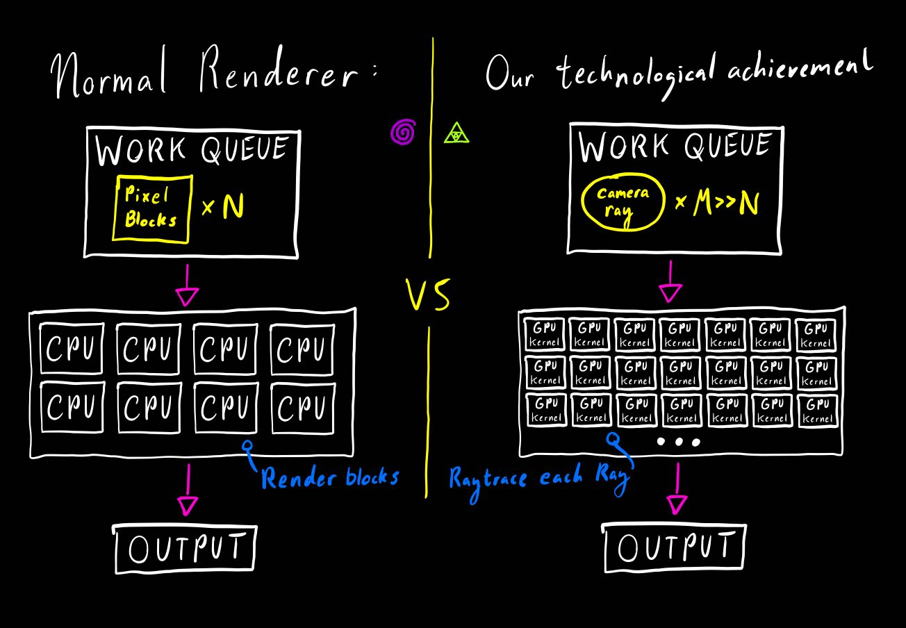

# CS 184: Computer Graphics and Imaging, Spring 2019
## Final Project: GPU Accelerated Pathtracing
###### Authors: William Sheu, Eric Zhou, Eamonn Carson

## Final Report Video Link
[Click here to see our final video presentation](https://www.youtube.com/watch?v=v59Jgd8jITQ&feature=youtu.be)

## Project Presentation Link
[Click here to see our project presentation](https://docs.google.com/presentation/d/1ynO1Ty_dc1L0bplnjsn1DCE716DPAUe8XLh9mb8yZ8E/edit?usp=sharing)

## Milestone Report Link
[Click here to see our milestone report from 4/30/2019 for this project](./milestone_report)

## Abstract
###### (A paragraph summary of the entire project.)
    
Our project was to accelerate ray-tracing utilizing the GPU to take advantage of the embarassingly parallel computations of individual rays.
Each computation of the contribution of each sampled ray to the final image is independent from all others, so we can sample each ray in parallel on the GPU.
This parallelization is important because it represents an avenue of optimization which can speed up rendering significantly; this allows for reduced computation for commercial raytracing applications, and makes real-time raytracing for videogames and other interactive settings feasible.
Overall we found that our relatively unoptimized GPU-accelerated raytracing implementation significantly outperforms basic CPU ray-tracing implementations by up to 20x (e.g. project 3-2) on simple scenes without sacrificing render quality. 

## Technical approach
###### (A 1-2 page summary of your technical approach, techniques used, algorithms implemented, etc. (use references to papers or other resources for further detail). Highlight how your approach varied from the references used (did you implement a subset, or did you change or enhance anything), the unique decisions you made and why.)

### A note about resources
The instructions for this section say to go over what resources and papers we referenced in order to build this and how we differed from their strategies. Overall we did not reference any real resources other than project 3-2 and the OpenCL documentation.
Our implementation for this project does not radically differ from the implementation of project 3-2 (the process and architecture are generally the same, just implemented using kernels and OpenCL).

There are a couple algorithmic differences though. 
First, since kernels cannot communicate between eachother, adaptive sampling was axed, since that would require that we do sequential processing of each sample. Technically since our final product parallelizes by pixel this could be achieved, but our goal was to have one kernel per traced ray which would render this strategy impossible, so we did not implement adaptive sampling.
Second, we decided not to use russian roulette because we felt that it would be ineffective. With kernels since they run in parallel (generally with single-instruction-multiple-data SIMD) the runtime of the kernel is going to be the runtime of the longest kernel in the same batch. Russian roulette is effective because it allows you to short-circuit some computations while still keeping your estimator of the amount of light unbiased.
In our case since the length of a set of runs is dictated by the length of the longest run, short-circuiting does not reduce the runtime as much. we felt that keeping the branching factor down by not including short-circuiting would probably lead to more efficient code than implementing short-circuiting.

### Why OpenCL?
Among the suggested options for this project was implementing GPU-accelerated ray-tracing using the NVIDIA OptiX library; however, we decided that we wanted our ray-tracer to be truly cross platform so instead we decided to implement the ray-tracer in OpenCL. 
Overall we were able to mostly achieve our goal, and got our program to compile properly on Ubuntu and Windows. We did not make this program OSX compatible, becuase we learned after starting that OSX had deprecated OpenCL in favor of Metal and OSX was being obtuse in general.

### Overall approach

The basic concept that makes GPU ray-tracing a good idea is that ray-tracing is an *embarassingly parallel* task.
What this means is that the computation of each ray is independent from the computation of any other ray, which means that we can parallelize the computation.
With an 8-core CPU this means that you can compute the contributions of 8 rays in parallel, which yields an 8x speedup (ignoring overhead) compared to running the computation naively on a single core.
However, on a GPU we can have over a hundred "cores" running the same ray-tracing operation, and receive a proportional speedup (again ignoring overhead).

To that end, our algorithmic approach to implementing a GPU-accelerated ray-tracer was not all that different from implementing a CPU ray-tracer.
The only algorithmic difference was that instead of parallelizing the computation of pixel batches we parallelized the computation of individual pixels (though it would be more efficient to parallelize individual ray computations, we didn't have time to implement that properly).

### Technical Details
First, there are a few gritty technical details which we had to deal with.
In order to use GPU kernels to render the scene you have to transfer scene variables and data-structures over to the GPU's memory, and because of library limitations these datastructures had to be indexible as arrays. This was generally not too much of a hurdle for normal types of objects: lights in the scene, material BSDFs, and object geometries were easily portable.
However this was a more significant challenge with more specialized datastructures. Particularly we had to completely redesign the datastructure of our bounding volume hierarchy (BVH) so that it was in an array format and could be traversed as an array without recursion.

The general technical implementation consisted of the following steps:
1. Initialize OpenCL
2. Transfer scene data (BVH, lights, material bsdfs, camera variables, primitives) to the GPU
3. Setup output buffer for the kernels to write to and send that to the GPU
4. Setup OpenCL commandQueue containing kernel jobs (either pixels or individual rays)
5. Run kernels from commandQueue
6. Read output out of the output buffer and write them to the image
7. Output image

Within each kernel's process, we follow this process for each ray sample:
1. Generate a number unique to this kernel using the x, y, and sample number to be used as a seed for this kernel. Set this to be the random state.
2. Generate a random ray out of the camera that belongs to this sample's pixel
3. For each bounce:
    1. Intersect the ray with the BVH, finding the point at which it intersects the scene
    2. Calculate the global illumination at that point using direct lighting (looping through each of the lights in the scene)
    3. Calculate a new bounce direction using the BSDF of the material at your intersection point
    4. Simulate the new bounce in the next iteration.
4. Return the total illumination contributed by that ray by writing it into the output buffer

Note that we have to keep track of running multiplier for the contribution of each successive bounce (since we cannot use recursion).

To elaborate on the construction and access procedures of the BVH, there are two major changes: first, since we only can really transfer arrays we need to 'flatten' our BVH into an array, and second — since kernels are not allowed to perform recursion — we must simulate recursion using a for loop to access elements and perform intersections. 
As for the array necessity, we just represent the BVH as a flat array of BVH nodes each of which has variables that indicate their children and whether or not they are a leaf node and store in the leaf node an array of primitives. 
The more annoying aspect is the fact that we cannot use recursion, which means that we have to manually keep track of the 'next' node to go to in the recursion and how to backtrack to the parent node. 
We solved this by encoding the recursion strategy directly in the BVH tree itself: each BVH node has an exit node (which is its parent's right child (if it is a left child), or its grandparent's right child (if it is a right child)) and an entrance node (which is its left child if it is not a leaf node, and which is equal to its exit node if it is a leaf node). By following the entry node while the ray intersects the current node and following the exit node when it doesn't we get
pattern we need to properly do an intersection test with the BVH. See our code for more details.

### Limitations

There were a couple of features that we originally intended to include, but found were rendered extremely difficult or impossible due to library limitations. One was we intended to use a more general job-queue model where every segment of the ray ran on a different kernel; however, we found that OpenCL does not allow kernels to access the command queue in order to enqueue new jobs, so this was rendered impossible. Further, adaptive sampling was also rendered impossible to implement in a one-kernel-per-ray implementation because of the lack of ability to adaptively change the number of jobs enqueued.

Additionally, there are a few problems that we were unable to solve completely. First, for some reason our renders are darker than the baseline CPU renders. If you increase the brightness of the renders by about 40% they look fine though. Second, it turns out that a lot of systems limit the lifetime of a kernel on the GPU (e.g. Windows has WDDR TDW); this causes our program to crash since the GPU kernels don't return anything before they are prematurely killed. We have not come up with a fix for this within our codebase, although many systems have the option to turn these settings off via system panels. The consequence of the watchdog killing kernels is that our program will crash if sufficiently high-quality settings (-s 64 -l 32 on the hive machines) are passed in.

###### A description of problems encountered and how you tackled them.
## Problems encountered
We were faced with a few problems that stoppered our progress significantly along the way.

First, William realized that we couldn't just move the BVH onto the GPU because of the restrictions described before. He was the one who fixed this issue and implemented the flattened BVH so that the project could continue.

Second, we had a nasty bug due to incorrect initialization.
William while making the prototype rendering script did almost everything correctly first try; however, he made one little syntax error where he forgot to initialize the direct-lighting total vector with zeros. Since OpenCL is a low-level computational library, this naturally meant that this vector was filled with random garbage from memory, and this caused the renders on both William's and Eric's personal machine to just be random colours.
Meanwhile Eamonn was working on getting the code to compile on the hive machine's outdated versions of CMake and Clang, and once he did he ran the code and miraculously it worked seemingly fine. Apparently for some reason (probably because the hive machines are multi-user machines with proper security measures against reading other people's garbage, or something to that effect) the random garbage on the hive machines was close enough to zero that the program could be run and properly
debugged. This eventually led to Eamonn finding the syntax error and fixing the issue.

Third, because we just haphazardly placed our code into the project 3-2 framework we realized that the -f flag and rerendering after a render were causing the program to crash. Eric fixed that bug.

Also in general we ran into some bugs with our implementations (multiple bounces looking horrible, excessive noise, etc); and although this solution isn't scaleable we generally solved the issues by getting one of our partners to independently reimplement the code and then combining the good parts of each.

###### A description of lessons learned.
## Lessons Learned
Overall the most important thing we learned is how to interface with and utilize the GPU. The general process being:
1. Initialize the GPU library, and set it to use the GPU as a compute device.
2. Pass in a bunch of arrays which have data that your kernels all share and read from.
3. Setup an output array for the individual kernels to write their outputs to (give a different space to each kernel to avoid errors)
4. Create a matrix of arguments for individual kernels.
5. Send the job to the GPU and wait.
6. Once the GPU returns, you can read out the output from the output array and do what you want with it.

We also learned a few things about the general limitations of the GPU computations in OpenCL:
1. You can't enqueue new kernel jobs from within a GPU kernel.
2. You can't use recursion.
3. You need to have all input datastructures be arrays.

And one thing that we all learned is that GPU acceleration is actually pretty accessible: as long as you have a parallelizeable operation and working knowledge of the OpenCL library its very feasible to parallelize computation with the GPU.

## Results
###### Your final images, animations, video of your system (whichever is relevant). You can include results that you think show off what you built but that you did not have time to go over on presentation day.

## References

## Contributions from each team member

William Sheu wrote or refactored almost all the code in the project. To be specific his contributions were:
- Porting entire project 3-2 framework to OpenCL.
- Implementing pixel-based (1 OpenCL kernel per pixel) zero-bounce and multi-bounce ray-tracing.
- Implemented mirror, glass, and diffuse materials.

Eamonn Carson contributed the following:
- Implementing sample-based (1 OpenCL kernel per ray) zero-bounce and prototype multi-bounce ray-tracing.
- Debugging a progress-halting bug where an uninitialized variable was causing the rendered image to be affected heavily by garbage from memory.
- Getting the program to compile on the hive machines.
- Drawing diagrams in presentation (and in this final report).
- Writing milestone and final report.

Eric Zhou contributed the following:
- Creating milestone video and final video.
- Runnning benchmarks and compiling the deliverables.
- Getting the program to compile on Windows.
- Helping debug various issues encountered along the way
