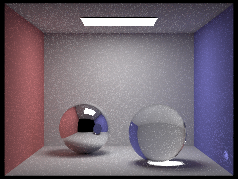

# CS 184: Computer Graphics and Imaging, Spring 2019
## Project 3-2: Pathtracer (2)
###### William Sheu, cs184-adw

## Overview

For this project, I expanded on the pathtracer from the previous part by adding
support for mirror, glass, and microfacet materials, as well as support for
environment lights and depth of field.

## Part 1: Mirror and Glass Materials

  
Spheres rendered with max ray depth of 0. Only the light source can be seen.

  
Max ray depth of 1: We can see the walls now, but we don't have enough bounces
for the spheres to have any color.

  
Max ray depth of 2: We see the ceiling, and we can see the environment from the
previous image reflected on the mirror sphere. We start to see the light source
in the glass sphere.

  
Max ray depth of 3: We see the scene from the previous image reflected in the
mirror sphere, and the scene from 2 images ago refracted in the glass
sphere. Notice that we can now see the walls in the glass sphere.

  
Max ray depth of 4: We see the scene from the previous image reflected in the
mirror sphere, and the scene from 2 images ago refracted in the glass
sphere. Notice that the glass sphere reflection on the mirror sphere is now lit
up, and the light in the glass sphere's shadow.

  
Max ray depth of 5: We see the scene from the previous image reflected in the
mirror sphere, and the scene from 2 images ago refracted in the glass
sphere. Note the light in the glass sphere's shadow now showing up in its
reflection on the mirror sphere.

  
Max ray depth of 100: Not too different from the previous render; just brighter
as the light bouncces more.

## Part 2: Microfacet Materials

  
Dragon with alpha of 0.005: Very glossy surface

  
Dragon with alpha of 0.05: Fairly glossy surface

  
Dragon with alpha of 0.25: Fairly matte surface, but still slightly glosssy

  
Dragon with alpha of 0.5: Very matte surface

  
Bunny rendered with hemisphere sampling - very noisy render

  
Bunny rendered with importance sampling - same render time, but much less noisy
render

  
Dragon rendered with silver as the material instead of gold

## Part 3: Environment Light

For environment lighting, we replace our black background with an environment
map. We sample from this environment for lighting when rays don't intersect any
primitives in the scene, so that the illumination and colors from the
environment are visible in our render. This lets us render scenes in various
environments without having to model the environments.

  
Grace EXR used to render the following images

  
Probability debug image for grace.exr

  
Bunny with uniform sampling - extremely noisy render

  
Bunny with importance sampling - very clear render

  
Microfacet bunny with uniform sampling - extremely noisy render

  
Microfacet bunny with importance sampling - much less noisy render

## Part 4: Depth of Field

With a pinhole camera model, every point in the scene is in focus. With a
thin-lens camera model, there is a focal plane where things are in focus, but
due to the way we sample from the lens, every other point will not be in focus.

  
Dragon rendered with focal distance at the nose

  
Dragon rendered with focal distance at the horns

  
Dragon rendered with focal distance around the middle

  
Dragon rendered with focal distance at the tail

  
Dragon rendered with focal distance at the nose, and a tiny aperture size

  
Dragon rendered with focal distance at the nose, and a small aperture size

  
Dragon rendered with focal distance at the nose, and a medium aperture size

  
Dragon rendered with focal distance at the nose, and a large aperture size
